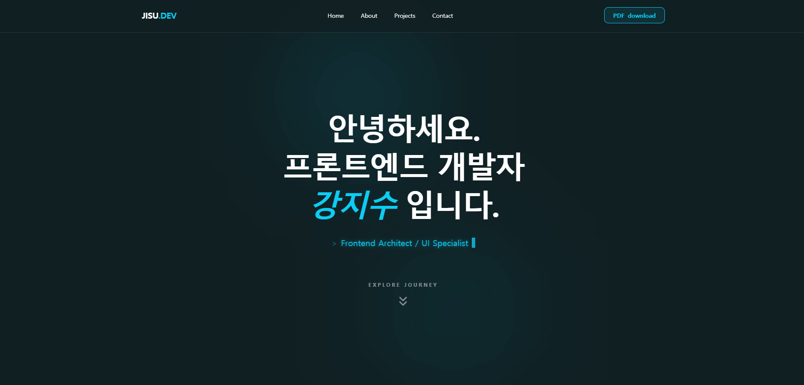

# 강지수 포트폴리오

Next.js(App Router) 기반의 프론트엔드 포트폴리오 프로젝트입니다.  
Hero, About, Project, Contact 섹션으로 구성되어 있으며, 프로젝트 상세 모달과 모션 UI를 포함합니다.

## 데모

- 배포 URL: `https://k-jisu-portfolio.vercel.app/`

## 주요 기능

- 섹션형 싱글 페이지 포트폴리오
- 프로젝트 카드 목록 및 상세 모달
- 프로젝트 이미지 캐러셀(Embla 기반)
- 공통 모션 유틸(`lib/motion.ts`)을 통한 섹션 애니메이션
- 반응형 레이아웃
- 이력서 PDF 다운로드

## 기술 스택

- Framework: `Next.js 16`, `React 19`, `TypeScript`
- Styling: `Tailwind CSS v4`
- Animation: `motion` (Framer Motion 최신 패키지)
- State: `Zustand`
- UI: `shadcn/ui`
- AI Tools: `Codex`, `Stitch`

## 프로젝트 구조

FSD(Feature-Sliced Design) 방식의 분리 원칙을 참고해 역할 중심으로 구조를 구성했습니다.

- `app`: 라우팅/레이아웃 등 앱 엔트리
- `widgets`: 페이지 섹션 단위 UI
- `features`: 도메인 기능(프로젝트)별 모델/프레젠테이션
- `shared`: 공용 UI와 전역 상태
- `lib`: 유틸리티 모듈

```text
app/
  layout.tsx
  page.tsx
features/
  main/
    model/
    ui/
widgets/
  home/ui/
  layout/ui/
shared/
  ui/
  store/
lib/
  motion.ts
```
